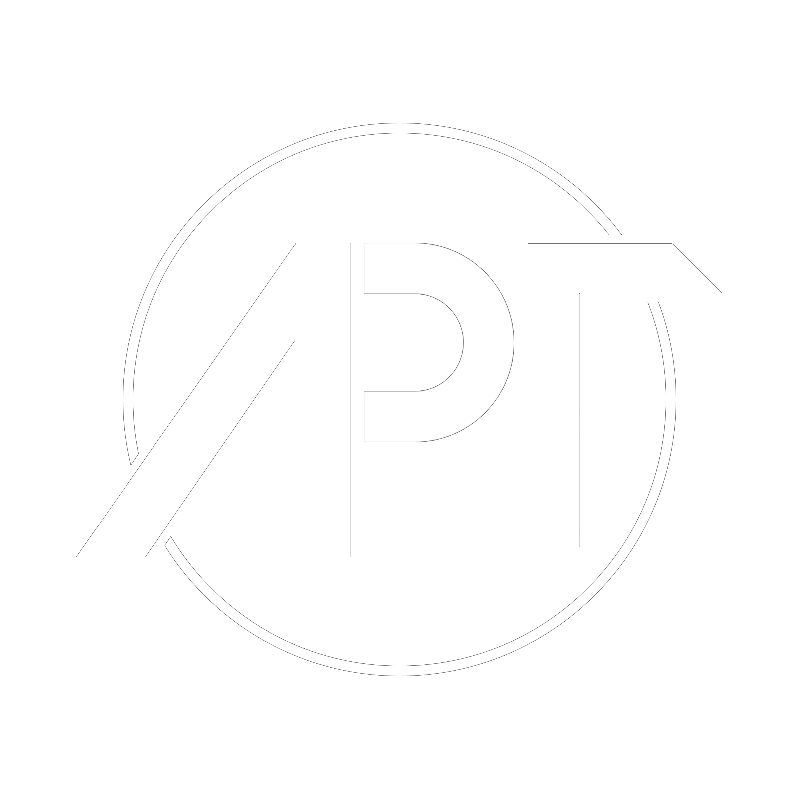

  

# APTeam Organization

A team of professional GD creators, artists, players and programmers.

## What Does This Organization Do?

This APTeam has its own programming branch. Everything from this branch is managed in this organization.

We mainly focus on the development of utility software, web development and Discord bots. For this we usually use C++, TypeScript and JavaScript.

## Our Team

We work with a small team of volunteers to achieve our goals. These are the following people:

- Zimnior12 (Product Owner)
- SMJS (Lead Developer)
- Fizzify (Developer)
- HJfod (Developer)

## Our Projects

So far this team has several in development and finished projects. These are the following:

### Patch-Loader

A dynamic Geometry Dash patch loader using a DLL injection.

`Status`: Finished

`Developer`: SMJS

`Languages`: C++

### APT-Bot

A discord bot which provides all the utilities required to maintain the APTeam.

`Status`: Finished

`Developer`: SMJS

`Languages`: TypeScript

### APT-API

A simple API to provide resources to the APTeam official website.

`Status`: Finished

`Developer`: SMJS

`Languages`: TypeScript

### GDTooblox

A mod/patch dashboard to easily install any modifications on the Geometry Dash client.

`Status`: In Development

`Developer`: SMJS

`Languages`: TypeScript, JavaScript, HTML, CSS

### APTeam Site

The main website of the APTeam making use of react.

`Status`: In Development

`Developer`: Fizzify

`Languages`: JavaScript, CSS

### GD-Optim

An optifine mod for Geometry Dash which heavily improves the performance of the game and provides analytical tools.

`Status`: In Development

`Developer`: SMJS

`Languages`: C++

## Social Media

- [Discord](https://discord.gg/YbVksz2)

### Zimnior12

- [Twitter](https://twitter.com/APTeamOfficial)
- [YouTube](https://youtube.com/c/GeometryDashZimnior12)

### SMJS

- [Twitter](https://twitter.com/SMJSGaming)
- [YouTube](https://youtube.com/c/SMJSProductions)
